# Lab 5: Security and Best Practices

## Lab Objectives

- Task 1: OIDC to Securely Connect to the Cloud
- Task 2: Securely Connect to the Cloud
- Task 3: Debugging and Monitoring Workflow
- Task 4: Agent Infrastructure [Read Only]

### Task 1: OIDC to Securely Connect to the Cloud

OpenID Connect (OIDC) allows your GitHub Actions workflows to access resources in Azure without needing to store the Azure credentials as long-lived GitHub secrets. This gives an overview of how to configure Azure to trust GitHub's OIDC as a federated identity and includes a workflow example for the Azure/Login action that uses tokens to authenticate to Azure and access resources.

1. Go to the Azure portal, search for **Microsoft Entra ID (1)**, and select **Microsoft Entra ID (2)**.  

   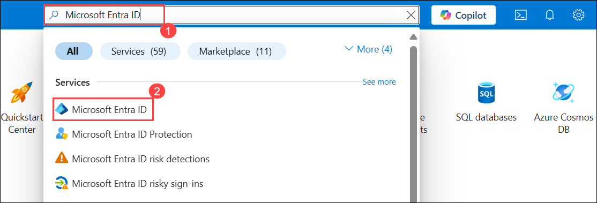  

1. On the Entra ID page, select **App registrations (1)** under the Manage section in the left panel. Then, select **All applications (2)** and choose **https://odl_user_sp_<inject key="DeploymentID" enableCopy="false"/> (3)**.  
  
     

1. Select **Certificates & secrets** **(1)** under **Manage**. Click on the **Federated credentials** **(2)** tab and select **+ Add credential** **(3)**.  

   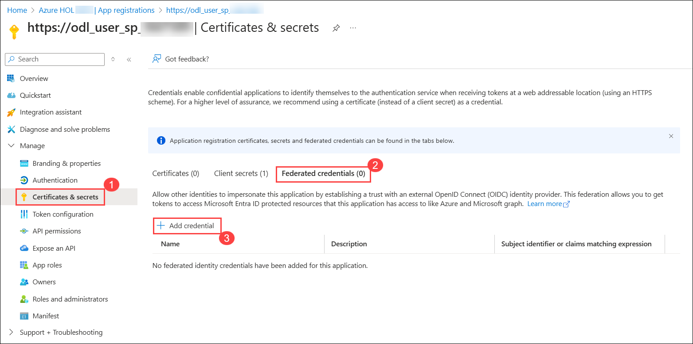  

1. On the **Add a credential** page, fill out the following details:  

    - **Federated credential scenario**: Select **GitHub Actions deploying Azure resources (1)**.
    - **Organization**: Provide the **GitHub Username (2)**, which is **github-cloudlabsuser-XXX**. Verify that there are no underscores ("_") in the GitHub username.
    - **Repository**: Provide the Repository name, that is **github-action** **(3)**. 
    - **Entity type**: Select **Branch (4)**.
    - **Based on selection**: Type **main (5)**.  

    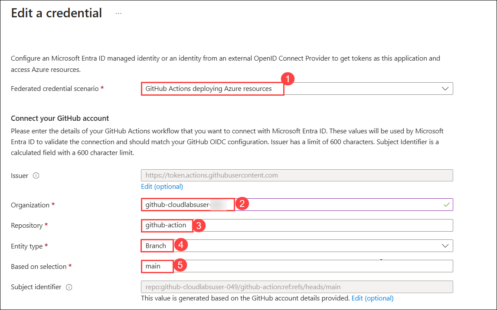  

1. Now, provide the **Name** as **OIDCCreds** **(1)** and click **Add** **(2)**.  

   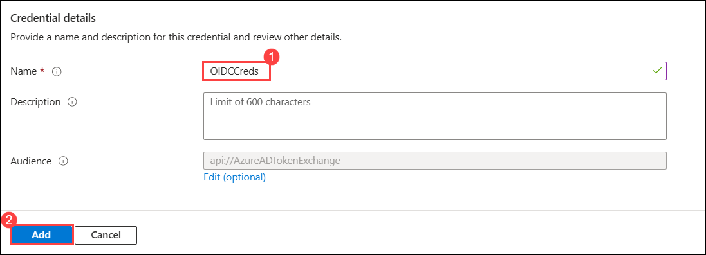  

1. Navigate back to the **github-action** repository, click on **Settings** **(1)**, select **Actions** **(2)** under **Secrets and variables**, and click on **New Repository Secret** **(3)**.  

   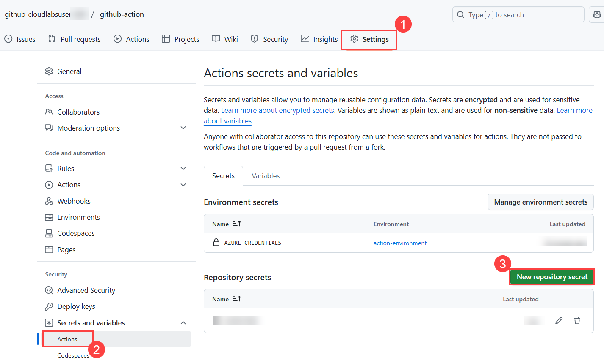  

1. To add repository secrets, go to the **Environment tab (1)** in the lab. Under **Service Principal Details (2)**, copy the values of **Application ID (3)**, **Tenant ID (4)**, and **Subscription ID (4)** for use in the next step.

    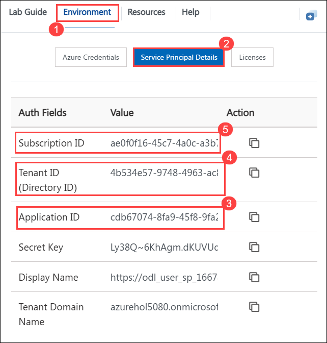  

1. Now, add the repository secrets as mentioned below:  

    - Provide the **Name** as **AZURE_CLIENT_ID (1)** and paste the **Application ID (2)** you copied previously from the Environment tab. Click on **Add Secret (3)**.

      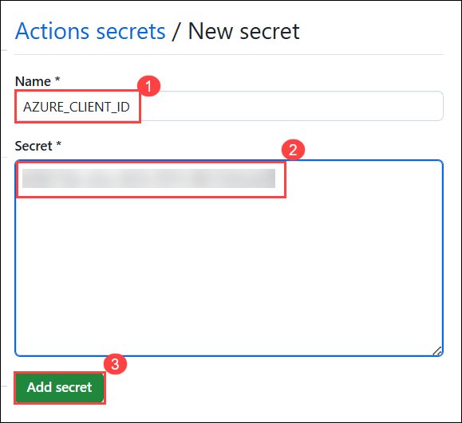  

    - Provide the **Name** as **AZURE_TENANT_ID (1)** and paste the **Tenant ID (Directory ID) (2)** you copied previously from the Environment tab. Click on **Add Secret** (3).  

      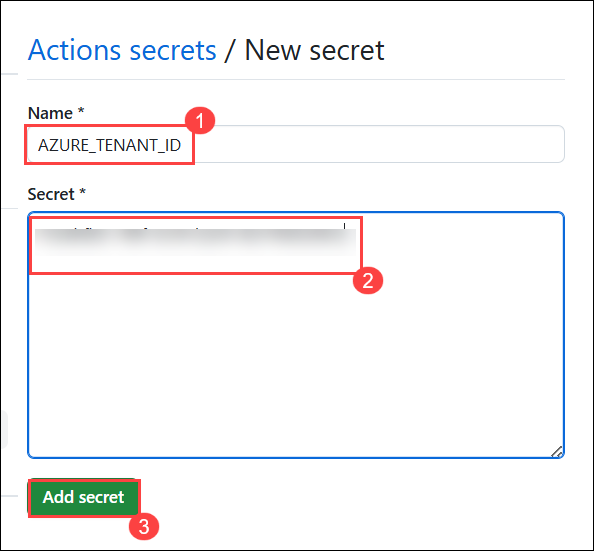  

    - Provide the **Name** as **AZURE_SUBSCRIPTION_ID (1)** and paste the **Subscription ID** **(2)** you copied previously from the Environment tab. Click on **Add Secret** (3).  

      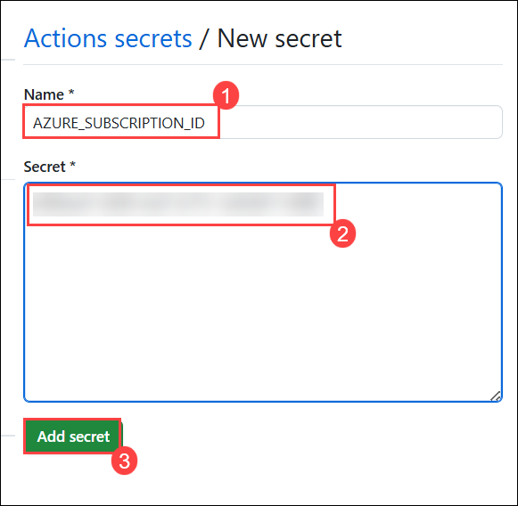  

 * **Note:** Make sure to verify the values entered for each repository secret.

1. Navigate to the **Code** **(1)** option and click on the **.github/workflows** **(2)** folder.

   

1. In the **.github/workflows** folder, click on **Add file** **(1)**, and select **+ Create new file** **(2)**.

   

1. Provide the file name as **OIDC_action.yml** **(1)**. In the editor, **copy and paste** **(2)** the below script, and click on **Commit changes** **(3)**.

    ```
     # File: .github/workflows/workflow.yml
   
      name: Run Azure Login with OIDC
      on: [push]
      
      permissions:
        id-token: write
        contents: read
      jobs:
        build-and-deploy:
          runs-on: ubuntu-latest
          steps:
            - name: Azure login
              uses: azure/login@v2
              with:
                client-id: ${{ secrets.AZURE_CLIENT_ID }}
                tenant-id: ${{ secrets.AZURE_TENANT_ID }}
                subscription-id: ${{ secrets.AZURE_SUBSCRIPTION_ID }}
      
            - name: Azure CLI script
              uses: azure/cli@v2
              with:
                azcliversion: latest
                inlineScript: |
                  az account show

    ```
 
   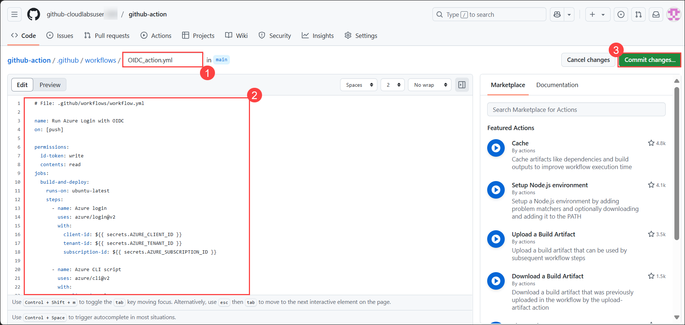   

1. Now, click on **Actions** **(1)**, then select **Run Azure Login with OIDC** **(2)** and click on **Create OIDC_action.yml** **(3)** workflow.  

   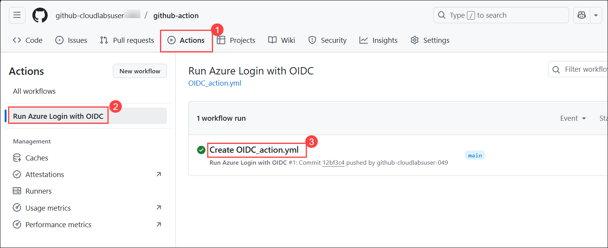  

1. Select **build-and-deploy (1)** and **verify** **(2)** that all the jobs have run successfully.  

   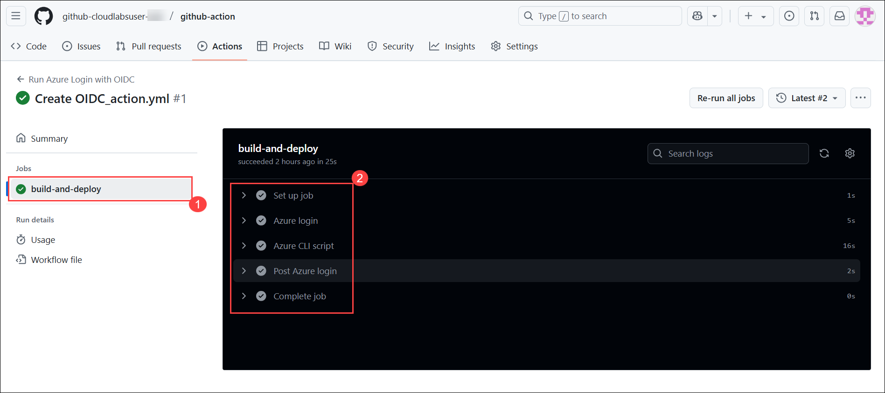  
    
   >**Note**: This GitHub Actions workflow automates authentication to Azure using OpenID Connect (OIDC) and executes an Azure CLI command to display the authenticated account details. It runs on every push event and uses repository secrets to securely authenticate.

>**Congratulations** on completing the Task! Now, it's time to validate it. Here are the steps:
> - Hit the Validate button for the corresponding task. If you receive a success message, you have successfully validated the lab. 
> - If not, carefully read the error message and retry the step, following the instructions in the lab guide.
> - If you need any assistance, please contact us at cloudlabs-support@spektrasystems.com.

   <validation step="de0bb9f2-4bc6-4c9b-9b97-f8d23a28378a" />


### Task 2: Securely Connect to the Cloud

1. Navigate back to the `github-action` repository. 

1. Navigate to the **Code** **(1)** option and click on the **.github/workflows** **(2)** folder.

1. In the **.github/workflows** folder, click on **Add file** **(1)**, and select **+ Create new file** **(2)**.

1. Provide the file name as **action.yml** **(1)**. In the editor, **copy and paste** **(2)** the below script, and click on **Commit changes** **(3)**.

    ```
    # File: .github/workflows/workflow.yml 
    
    on:
      push:
        branches:
          - main
        paths:
          - '.github/workflows/action.yml'
    
    name: Run Azure Login With a Service Principal Secret
    
    jobs:
    
      build-and-deploy:
        runs-on: ubuntu-latest
        steps:
    
        - uses: azure/login@v2
          with:
            creds: ${{ secrets.AZURE_CREDENTIALS }}
            enable-AzPSSession: true
    
        - name: Azure CLI script
          uses: azure/cli@v2
          with:
            azcliversion: latest
            inlineScript: |
              az account show
    
        - name: Azure PowerShell script
          uses: azure/powershell@v2
          with:
            azPSVersion: "latest"
            inlineScript: |
              Get-AzContext
    ```

1. In the **Commit changes** pop-up, click on the **Commit changes** button.

1. Click on the **Actions** **(1)** tab. Verify if the workflow has been executed successfully **(2)**.

   >**Note**: 
This GitHub Actions workflow demonstrates the best practice of securely using Azure secrets by employing GitHub Secrets. The workflow, triggered on every push, runs on ubuntu-latest and performs several steps, including logging into Azure with a service principal secret, executing an Azure CLI script, and running an Azure PowerShell script.

### Task 3: Debugging and Monitoring Workflow

Debugging and monitoring workflows in GitHub Actions involve using detailed logging, GitHub's job status and logs, and notifications for failures to identify and resolve issues. Integrating external logging services and setting up metrics and alerts can further enhance visibility and proactive issue management, ensuring more reliable and efficient development cycles.

In this task, you'll analyze and resolve an error with the workflow.

1. Navigate to the **Code** **(1)** option and click on the **.github/workflows** **(2)** folder.

      

2. In the **.github/workflows** folder, click on **Add file** **(1)**, and select the **+ Create new file** **(2)** option.

      

3. Provide the file name as **deploy-to-azure.yml** **(1)**. In the editor, **copy and paste** **(2)** the below script, and click on **commit changes** **(3)**.

    ```
    name: Debugging and Monitoring Workflow
    
    on: [push]
    
    jobs:
      build:
        runs-on: ubuntu-latest
    
        steps:
        - uses: actions/checkout@v2
    
        - name: Run missing script
          run: bash ./missing-script.sh
    ```

4. In the **Commit changes** pop-up window, click on the **Commit changes** option.

5. Click on the **Action** tab. Verify if the workflow has Failed, and click on the **Create deploy-to-azure.yml** workflow.

      .png)

6. Click on **build** **(1)**, expand **Run missing Script** **(2)**, and you'll see the error that `npm ERR! enoent ENOENT: no such file or directory, open 'Run bash ./missing-script.sh bash: ./missing-script.sh: No such file or directory` **(3)**.

      

7. Navigate to the **Code** **(1)** option, click on **Add File** **(2)**, and select **+ Create new file** **(3)**.
    
      
    
8. Provide the file name as **missing-script.sh** **(1)**. In the editor, **copy and paste** **(2)** the below script, and click on **commit changes** **(3)**.

    ```
    #!/bin/bash
    echo "This is a sample script."
    ```    

9. In the **Commit Changes** pop-up window, click on the **Commit changes** option.

10. Click on the **Action** tab. Verify if the workflow **Create missing-script.sh** has "Succedded".

       

11. Click on **Build** **(1)**, expand **Run missing script** **(2)**

       

       > **Note**: You just resolved an issue by creating the missing PowerShell script and triggering the workflow.

>**Congratulations** on completing the Task! Now, it's time to validate it. Here are the steps:
> - Hit the Validate button for the corresponding task. If you receive a success message, you have successfully validated the lab. 
> - If not, carefully read the error message and retry the step, following the instructions in the lab guide.
> - If you need any assistance, please contact us at cloudlabs-support@spektrasystems.com.

   <validation step="3534d8a9-a527-4d7a-be8d-4afc54ba6cec" />

### Task 4: Agent Infrastructure [Read Only]

#### About self-hosted runners

Self-hosted runners offer more control over hardware, operating systems, and software tools than GitHub-hosted runners provide. With self-hosted runners, you can create custom hardware configurations that meet your needs with processing power or memory to run larger jobs, install software available on your local network, and choose an operating system not offered by GitHub-hosted runners. Self-hosted runners can be physical, virtual, in a container, on-premises, or in a cloud.

You can add self-hosted runners at various levels in the management hierarchy:

    - Repository-level runners are dedicated to a single repository.
    - Organization-level runners can process jobs for multiple repositories in an organization.
    - Enterprise-level runners can be assigned to multiple organizations in an enterprise account.

**Differences between GitHub-hosted and self-hosted runners**

| GitHub-hosted runners    | Self-hosted runners      | 
| ------------------------ | ------------------------ |
| Receive automatic updates for the operating system, preinstalled packages and tools, and the self-hosted runner application. | Receive automatic updates for the self-hosted runner application only, though you may disable automatic updates for the runner. For more information about controlling runner software updates on self-hosted runners, see [Autoscaling with self-hosted runners](https://docs.github.com/en/actions/hosting-your-own-runners/managing-self-hosted-runners/autoscaling-with-self-hosted-runners#controlling-runner-software-updates-on-self-hosted-runners). You're responsible for updating the operating system and all other software.|
| Are managed and maintained by GitHub. | You can use cloud services or local machines that you already pay for. |
| Provide a clean instance for every job execution. | Are customizable to your hardware, operating system, software, and security requirements. |
| Use free minutes on your GitHub plan, with per-minute rates applied after surpassing the free minutes. | - Don't need to have a clean instance for every job execution. <br> - Are free to use with GitHub Actions, but you're responsible for the cost of maintaining your runner machines.|

**Usage limits**

There are some limits on GitHub Actions usage when using self-hosted runners. These limits are subject to change.

* **Job execution time** - Each job in a workflow can run for up to 5 days of execution time. If a job reaches this limit, the job is terminated and fails to complete.
* **Workflow run time** - Each workflow run is limited to 35 days. If a workflow run reaches this limit, the workflow run is canceled. This period includes execution duration, time spent waiting, and approval.
* **Job queue time** - Each job for self-hosted runners that has been queued for at least 24 hours will be canceled. The actual time in the queue can reach up to 48 hours before cancellation occurs. If a self-hosted runner does not start executing the job within this limit, the job is terminated and fails to complete.
* **API requests** - You can execute up to 1,000 requests to the GitHub API in an hour across all actions within a repository. If requests are exceeded, additional API calls will fail, which might cause jobs to fail.
* **Job matrix** - A job matrix can generate a maximum of 256 jobs per workflow run. This limit applies to both GitHub-hosted and self-hosted runners.
* **Workflow run queue** - No more than 500 workflow runs can be queued in a 10-second interval per repository. If a workflow run reaches this limit, the workflow run is terminated and fails to complete.
* **Registering self-hosted runners** - You can have a maximum of 10,000 self-hosted runners in one runner group. If this limit is reached, adding a new runner will not be possible.

* For more information, go through [About self-hosted runners](https://docs.github.com/en/actions/hosting-your-own-runners/managing-self-hosted-runners/about-self-hosted-runners).

#### Managing larger runners

Larger runners are specialized virtual machines with more computational resources, ideal for workflows that require high performance or extensive parallelism.

1. **Larger Runners Overview:**

    - **Purpose**: Larger runners are designed to handle more demanding CI/CD workloads.
    - **Benefits**: They provide greater CPU, memory, and storage, allowing for faster execution of complex tasks.

2. **Managing Access:**

    - **Configuration**: To allow repositories to use larger runners, specific configurations must be set up within the repository or organization settings.
    - **Repository Settings**: Administrators can enable or restrict access to larger runners for specific repositories.
    - **Security**: Proper management ensures that only authorized workflows utilize these powerful resources, preventing misuse and optimizing costs.

3. **Benefits of Larger Runners:**

    - **Efficiency**: Larger runners reduce the time required to complete workflows, improving overall efficiency.
    - **Scalability**: They support larger projects with significant computational requirements, enabling scalability.
    - **Resource Management**: Effective use of larger runners can lead to better resource management and cost savings.

By properly configuring and managing access to larger runners, organizations can leverage enhanced computational resources to optimize their CI/CD processes on GitHub.

- For more information, go through [Managing larger runners](https://docs.github.com/en/actions/using-github-hosted-runners/about-larger-runners/managing-larger-runners).


#### Controlling access to larger runners

How to manage and restrict access to these enhanced computational resources within GitHub Actions. This ensures that only authorized repositories can utilize the larger runners, maintaining security and resource efficiency.

1. **Controlling Access Overview:**

    - **Purpose**: Access control is crucial to prevent unauthorized use of larger runners, which can lead to unnecessary costs and potential security risks.
    - **Scope**: Access can be managed at both the organization and repository levels, providing flexibility in how resources are allocated and used.

2. **Best Practices:**

    - **Regular Review**: Periodically review which repositories have access to ensure that only those that need the resources are allowed.
    - **Audit Logs**: Utilize audit logs to monitor the usage of larger runners, identifying any unauthorized access or anomalies.
    - **Cost Management**: Keep track of the costs associated with using larger runners to manage budgets effectively.

3. **Security Considerations**:

    - **Restrictive Access**: Start with restrictive access settings and gradually allow more repositories as needed.
    - **User Permissions**: Ensure that only trusted users and workflows have permissions to configure and use larger runners.

By implementing these access control measures, organizations can efficiently manage their computational resources, ensuring that larger runners are used appropriately and securely within their GitHub Actions workflows.

-  For more information, go through [Controlling access to larger runners](https://docs.github.com/en/actions/using-github-hosted-runners/about-larger-runners/controlling-access-to-larger-runners).

#### Running jobs on larger runners

> **Note**: Larger runners are only available for organizations and enterprises using the GitHub Team or GitHub Enterprise Cloud plans.

GitHub Actions provides a powerful platform for automating software workflows, including CI/CD pipelines. With the introduction of larger GitHub-hosted runners, you can now execute jobs on more powerful machines. These larger runners are available across macOS, Linux, and Windows environments, offering increased computational resources to handle more demanding workloads. These larger runners are available across macOS, Linux, and Windows environments, offering increased computational resources to handle more demanding workloads.

-  For more information, go through [Running jobs on larger runners](https://docs.github.com/en/actions/using-github-hosted-runners/about-larger-runners/running-jobs-on-larger-runners).

#### Adding self-hosted runners

Adding self-hosted runners to your GitHub repositories, organizations, or enterprises can significantly bolster your workflow automation capabilities. These dedicated computing resources execute GitHub Actions workflows, offering flexibility and control over your processes.

Administrators at the organization or enterprise level benefit from adding self-hosted runners, as it streamlines management and makes them accessible across multiple repositories. Centralized control allows for efficient resource allocation and monitoring.

However, caution is advised, especially with public repositories. It's strongly recommended to primarily use self-hosted runners with private repositories due to the potential security risks. Public repositories, when forked, may execute malicious code on self-hosted runner machines triggered by pull requests.

To optimize workflows and ensure security, automation can be set up to dynamically scale the number of self-hosted runners based on workload demands. GitHub's features, like just-in-time runner registration for ephemeral runners add an extra layer of security by cleaning up temporary runners after a single job.

Before adding self-hosted runners, ensure prerequisites are met, such as having access to the designated machine for hosting the runner.

To add a self-hosted runner to a specific repository, follow GitHub's guidelines. Depending on the repository type (user or organization), appropriate permissions are required (repository owner for user repositories, organization owner or admin access for organization repositories).

For advanced management, organization owners can control which repositories are allowed to create repository-level self-hosted runners, providing granular control over their use within the organization.

Detailed instructions and further information are available in the GitHub documentation, including REST API endpoints for self-hosted runners and guidance on disabling or limiting GitHub Actions for organizations. Overall, self-hosted runners offer a powerful way to customize and enhance GitHub Actions workflows, but careful consideration of security implications is crucial, especially in public repository environments.

- For more information, go through [Adding self-hosted runners](https://docs.github.com/en/actions/hosting-your-own-runners/managing-self-hosted-runners/adding-self-hosted-runners).

## Summary

In this lab, you have connected OIDC securely to the Cloud, checked on debugging and monitoring Workflow and understood the Agent Infrastructure.

### You have successfully completed the lab!
