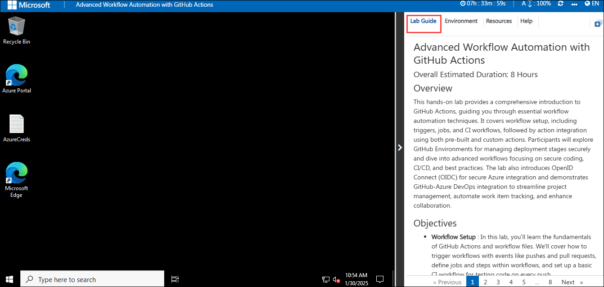
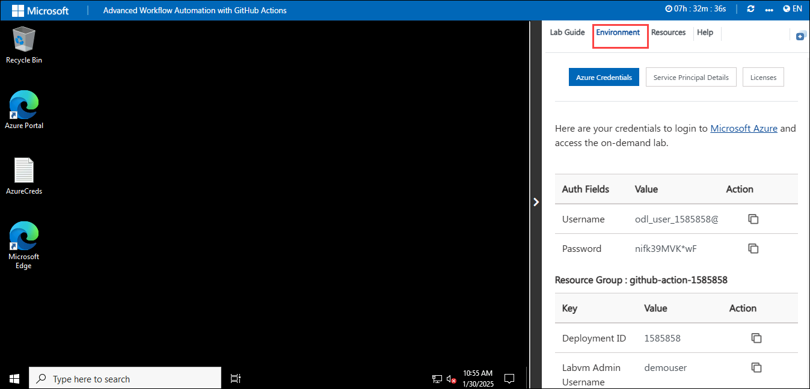
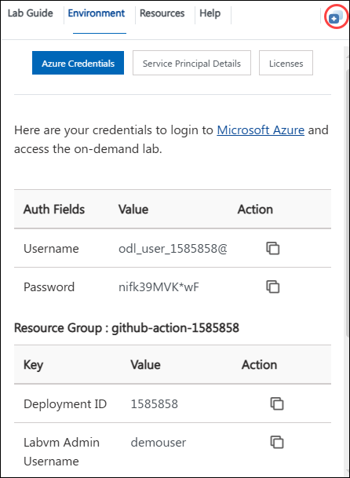
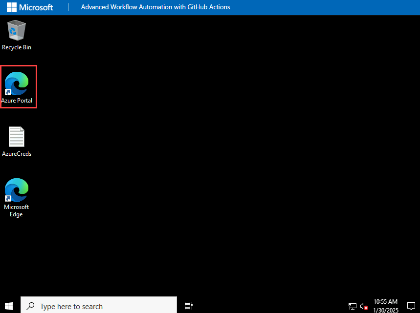

# Advanced Workflow Automation with GitHub Actions

### Overall Estimated Duration: 8 Hours
## Overview

This hands-on lab provides a comprehensive introduction to GitHub Actions, guiding you through essential workflow automation techniques. It covers workflow setup, including triggers, jobs, and CI workflows, followed by action integration using both pre-built and custom actions. Participants will explore GitHub Environments for managing deployment stages securely and dive into advanced workflows focusing on secure coding, CI/CD, and best practices. The lab also introduces OpenID Connect (OIDC) for secure Azure integration and demonstrates GitHub-Azure DevOps integration to streamline project management, automate work item tracking, and enhance collaboration.

## Objectives

- **Workflow Setup** : In this lab, you'll learn the fundamentals of GitHub Actions and workflow files. We'll cover how to trigger workflows with events like pushes and pull requests, define jobs and steps within workflows, and set up a basic CI workflow for testing code on every push.
- **Action Integration** : In this lab, you wil focus on incorporating pre-built actions from the GitHub Marketplace and creating custom actions for reusable tasks.
- **Advanced Workflows** : In this lab, you will learn and apply secure coding practices, version control, automated testing, CI/CD, and development security to ensure high-quality, consistent, and secure software. 
- **GitHub Environment** : This is lab is about configuring GitHub Environments. GitHub environments in GitHub Actions allow you to define and manage deployment environments like development, staging, and production. They include protection rules such as required reviewers, wait times, and environment-specific secrets to enhance security and control.
- **Security and Best Practices** : In this lab, you will be introduced with OpenID Connect (OIDC), a protocol that allows GitHub Actions workflows to securely access Azure resources without storing Azure credentials as long-lived GitHub secrets.
- **Integrating with Azure DevOps** : In this lab, you will integrate GitHub with Azure DevOps to seamlessly link GitHub pull requests to Azure Boards. This will enable streamlined project management, automated work item updates, and enhanced traceability of code changes for improved collaboration.

## Prerequisites

- Familiarity with repositories, branches, pull requests, and commits.
- Awareness of continuous integration and deployment principles.
- Understanding of Git workflows and version control best practices.

## Getting Started with the Lab
Welcome to your Advanced Workflow Automation with GitHub Actions Workshop! We've prepared a seamless environment for you to explore and learn about Azure services. Let's begin by making the most of this experience.
 
## Accessing Your Lab Environment
 
Once you're ready to dive in, your virtual machine and lab guide will be right at your fingertips within your web browser.

  

## Exploring Your Lab Resources
 
To get a better understanding of your lab resources and credentials, navigate to the **Environment** tab.
 
  
 
## Utilizing the Split Window Feature
 
For convenience, you can open the lab guide in a separate window by selecting the **Split Window** button from the Top right corner.
 
  

## Managing Your Virtual Machine
 
Feel free to start, stop, or restart your virtual machine as needed from the **Resources** tab. Your experience is in your hands!

  

## Lab Validation

1. After completing the task, hit the **Validate** button under Validation tab integrated within your lab guide. If you receive a success message, you can proceed to the next task, if not, carefully read the error message and retry the step, following the instructions in the lab guide.

   

## Lab Guide Zoom In/Zoom Out
 
1. To adjust the zoom level for the environment page, click the **A↕ : 100%** icon located next to the timer in the lab environment.

     
 
## Login to the Azure Portal

1. In the **JumpVM**, click on the **Azure portal shortcut** of the Microsoft Edge browser, which is created on the desktop.

   

1. On the **Sign in to Microsoft Azure** tab, you will see the login screen. Enter the email or username, and click on **Next**. 

   * **Email/Username**: **<inject key="AzureAdUserEmail"></inject>**

     
     
1. Now enter the password and click on **Sign in**.
   
   * **Password**: **<inject key="AzureAdUserPassword"></inject>**

     
   
1. If you see the pop-up **"Stay Signed in?"** Select **No**.

   

1. If a **Welcome to Microsoft Azure** pop-up window appears, select **Cancel** to skip the tour.

    
   
1. Now that you are able to see the **Azure Portal Dashboard**, click on the **Resource groups** option from the **Navigate panel** to check out the available resource groups.

   .png)

1. In the **Resource groups** section, click on the **github-action-xxxx<inject key="DeploymentID" enableCopy="false"/>** resource group.

   

1. Once redirected to the **github-action-xxxx<inject key="DeploymentID" enableCopy="false"/>** resource group, verify the resources present in it.

   

## Support Contact
The CloudLabs support team is available 24/7, 365 days a year, via email and live chat to ensure seamless assistance at any time. We offer dedicated support channels tailored specifically for both learners and instructors, ensuring that all your needs are promptly and efficiently addressed.

Learner Support Contacts:

   - Email Support: cloudlabs-support@spektrasystems.com
   - Live Chat Support: https://cloudlabs.ai/labs-support

Now you're all set to explore the powerful world of technology. Feel free to reach out if you have any questions along the way. Enjoy your workshop!

Now, click on **Next** from the lower right corner to move on to the next page.

  

## Happy Learning!!
